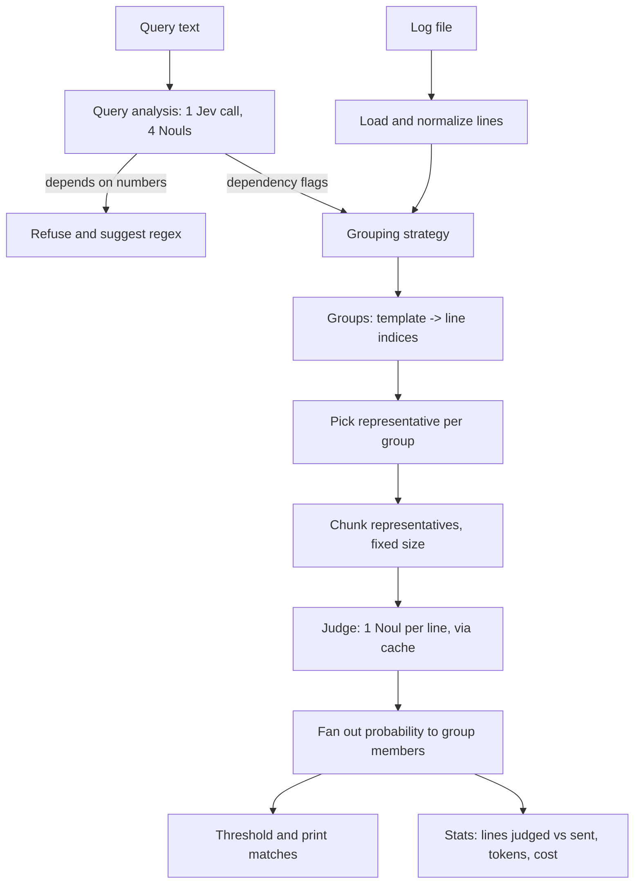

# sift — Query-Aware Deduplication for Semantic Log Search

> Working name: **sift**. Rename freely.
> This document is the single source of truth for the project: what we're building, why, how the pieces fit, every design decision and its reasoning, how we evaluate, and how we ship it. Keep it in the repo root and update it as decisions change.

---

## 1. One-paragraph pitch

Semantic log search ("find lines that *mean* X") is useful but costs money per line. Logs are mostly repetition, so the standard fix is **template deduplication**: mask the variable parts (numbers, IDs, IPs), judge one representative per template, and copy the answer to every line in the group. That fix is only correct when the question doesn't depend on the masked parts, and existing tools apply one fixed mask to every query. **sift makes the mask depend on the query**: one cheap Jev call first decides what the query depends on (usernames? IPs? paths? numbers?), and only the irrelevant parts are masked. When a query depends on numeric comparisons, sift refuses and recommends a regex, because numeric reasoning is a documented weakness of the model.

---

## 2. Motivation

### 2.1 The problem

- Cost scales with text sent. A log with 100k lines might contain only a few hundred distinct messages.
- Exact dedup barely helps, because nearly every line differs somewhere (timestamp, PID, request ID).
- Template dedup helps a lot, but it is **silently wrong** for some queries.

### 2.2 The failure mode we target

Log template miners like Drain replace every varying token with a wildcard. On OpenSSH logs:

```
Invalid user admin from 173.234.31.186
Invalid user jsmith from 52.80.34.196
→ template: Invalid user <*> from <*>
```

For the query *"failed login attempts"*, merging these is fine: both match.
For the query *"login attempts using default account names like admin, oracle, test"*, merging is wrong: one line matches and the other doesn't, but they share one verdict. Recall collapses, and nothing in the output tells you.

### 2.3 The idea

A grouping is **safe for a query** if every line in each group would get the same answer to that query. We can't check that directly without judging every line, which defeats the purpose. But we can ask the model a much cheaper question first: *does this query depend on usernames / IPs / paths / numbers?* Then we keep those fields distinct and mask the rest.

### 2.4 Why this is a good portfolio project

- It is a real, documented problem (open issues in the community tool jev-semgrep discuss both dedup and batching effects).
- The contribution is small and finishable, but it requires understanding *why* the standard approach fails.
- It has a clean evaluation story with ground truth, not just screenshots.

---

## 3. Goals and non-goals

### Goals

1. A CLI that runs semantic search over a log file with three grouping strategies: `none` (baseline), `drain` (standard dedup), `query-aware` (ours).
2. A reproducible evaluation on public data with ground truth, measuring correctness *and* cost.
3. Three demo stories backed by numbers.
4. A clean repo someone can clone and run in under 5 minutes.

### Non-goals (explicitly out of scope)

- Multi-line records (stack traces, git log entries). Mention as future work.
- A production service, UI, or streaming ingestion.
- Beating Drain at template mining. We use Drain3 as-is.
- Supporting every log format. OpenSSH is primary; Apache and Linux are secondary.
- Numeric queries. We detect and refuse them by design.

---

## 4. Background you need to be able to explain

### 4.1 Jev in one minute

Jev is a judgment model, not a text generator. You send a **state** (the text to judge) and a map of typed **questions**; it returns typed answers.

| Question type | Returns | We use it for |
|---|---|---|
| `Noul` | probability 0–1 that a statement is true | every judgment in this project |
| `Choice` | pick one label + confidence + probabilities | not used (see Decision D4) |
| `Score` | position on an ordered rubric | not used |

All questions in one call see the same state and are answered independently and in parallel, so adding questions barely changes latency.

### 4.2 Documented weaknesses we design around

- Weak at numeric precision and counting → **numeric queries are refused** (D9).
- Reads instructions literally → question wording is explicit and tested (D8).
- Verdicts can depend on which other lines share a request (reported in jev-semgrep issue #9) → **fixed chunk size and ordering** across all strategies (D6).

### 4.3 Template mining

Drain (and its maintained Python port, Drain3) builds templates online by grouping log messages with the same token count and similar constant tokens, replacing varying positions with `<*>`. It's the standard baseline in the log-parsing literature, which is why we use it as the "standard dedup" strategy rather than inventing our own.

### 4.4 The correctness condition (memorize this sentence)

> A judgment on a representative can be copied to every member of its group **if and only if the query's answer does not depend on anything that differs between members.**

Everything in this project follows from that sentence.

---

## 5. Architecture

### 5.1 Pipeline



### 5.2 Step by step

1. **Load.** Read lines, strip the trailing newline, keep the original index. For Loghub files, also load the structured CSV so evaluation knows each line's true template (`EventId`).
2. **Query analysis.** State = the query. Four Nouls ask whether answering it depends on: identity (users, accounts, hostnames), network addresses, file paths, numeric comparison. Output: a set of flags. Cost: one call per search, negligible.
3. **Refuse if numeric.** If `depends_on_numbers` is above its threshold, print an explanation and exit. No line-level calls are made.
4. **Group.**
   - `none`: every line is its own group (baseline).
   - `drain`: Drain3 template → group.
   - `query-aware`: Drain3 groups, then **split** each group by the values of the parameters the query depends on (e.g., the username in `Invalid user <*> from <*>`).
5. **Representative.** The longest member of each group (D7).
6. **Chunk and judge.** Representatives, in original file order, go into chunks of fixed size N. Each chunk is one call: the state lists lines with IDs, and there is one Noul per line.
7. **Fan out.** Each member line inherits its representative's probability.
8. **Output.** Lines with probability ≥ threshold, with original line numbers, plus a stats line on stderr.

### 5.3 Why "split" is the key trick

Splitting a group can only make it purer. The worst case of an unnecessary split is extra cost, never a wrong answer. Masking too much is the dangerous direction; masking too little just costs money. So the query-aware strategy starts from Drain's aggressive grouping (cheap) and only undoes it where the query analysis says it matters. That asymmetry drives several decisions below.

---

## 6. Project structure

```
sift/
├── README.md                  # the public face: pitch, demo GIF, results table, quickstart
├── DESIGN.md                  # this file
├── pyproject.toml             # dependencies, ruff config, `sift` CLI entry point
├── .env.example               # TYPESAFE_API_KEY=...
├── .gitignore                 # .env, .cache/, data/raw/, __pycache__/
│
├── data/
│   ├── README.md              # how to download Loghub-2k (corrected); license note
│   └── raw/                   # gitignored; downloaded logs live here
│
├── labels/                    # committed; this is part of your contribution
│   ├── queries.yaml           # query set: id, text, dataset, labeling method
│   ├── openssh_template_labels.csv   # EventId x query_id -> 0/1, hand-labeled
│   └── analyzer_testset.yaml  # ~20 queries with expected dependency flags
│
├── src/sift/
│   ├── __init__.py
│   ├── cli.py                 # argparse/typer entry: `sift search ...`
│   ├── config.py              # model id, chunk size, thresholds, prices (one place)
│   ├── io.py                  # load raw logs and Loghub structured CSVs
│   ├── jev.py                 # thin client wrapper: caching, retries, usage accounting
│   ├── cache.py               # sqlite cache keyed by request hash
│   ├── query_analysis.py      # the 4-Noul dependency check + refusal logic
│   ├── grouping/
│   │   ├── __init__.py        # strategy registry: none | drain | query-aware
│   │   ├── drain.py           # Drain3 wrapper returning template ids + parameters
│   │   └── refine.py          # split Drain groups by dependent parameter values
│   ├── judge.py               # chunking, Noul construction, fan-out
│   └── pipeline.py            # glues the steps; returns matches + stats object
│
├── eval/
│   ├── ground_truth.py        # template labels -> line labels; code-based labels
│   ├── metrics.py             # precision/recall, label-impure groups, agreement, cost
│   ├── run_experiments.py     # runs every (dataset, query, strategy) combination
│   └── plots.py               # figures for README and LinkedIn
│
├── results/                   # committed CSVs and PNGs from the final run
│
└── tests/
    ├── test_grouping.py       # splitting never merges, fan-out preserves indices
    ├── test_metrics.py        # metrics on tiny hand-made fixtures
    └── test_judge.py          # chunk construction, ID mapping, cache hit behavior
```

**Why this layout:** `src/` layout prevents accidentally importing uncommitted local files. `labels/` is separate from `data/` because labels are *your* work and get committed, while raw data is downloaded and gitignored. `eval/` is separate from `src/` because the tool must work without the evaluation code; this separation is something reviewers look for.

---

## 7. Design decisions

Each decision: what we chose, why, what we rejected. These are your interview answers.

### D1. Python

- **Why:** official TypeSafe Python SDK, Drain3 is Python, pandas/matplotlib for evaluation.
- **Rejected:** Node (jev-semgrep's language). Contributing there is a stretch goal, but the evaluation work is much easier in Python.

### D2. Pin the model version (`jev-1.13.0`, not `jev-latest`)

- **Why:** thresholds and results must be reproducible. An alias can move to a new model and silently change your numbers.
- **Where:** `config.py`, and recorded in every results CSV row.
- **Check:** confirm the exact model string on the TypeSafe models page before starting.

### D3. Cache every API response to disk

- **Why:** you will rerun experiments many times. Caching makes reruns free and instant, and makes results reproducible from the cache alone.
- **How:** key = SHA-256 of `(model, state, questions)` serialized as canonical JSON. Store in sqlite (stdlib, no extra dependency).
- **Consequence:** cost reporting must use the *usage recorded at first call*, stored with the cached response, not a count of cache misses.

### D4. Noul per line, not Choice over lines

- **Why:** the question is "does this line match?", a yes/no per line. Choice forces probabilities to sum to 1 across options, so *some* line always wins even when none match. The official line-search cookbook works around this by adding an extra Noul; we avoid the problem entirely.
- **Trade-off:** more questions per call, but questions are nearly free in latency.

### D5. State format: numbered lines

```
L001: Invalid user admin from 173.234.31.186
L002: Accepted password for alice from 10.0.0.5 port 22 ssh2
```

One Noul per ID: *"Does line L002 match this description: <query>? Answer only about line L002."*
- **Why:** IDs let each question point at exactly one line; the explicit "only about line" counters literal-reading ambiguity.
- **Rejected:** one line per call. Much slower and more expensive per line, and not how batching tools work in practice.

### D6. Fixed chunk size and order across all strategies

- **Why:** a line's verdict can depend on its neighbors in the same request. If the baseline uses chunks of 30 and dedup uses chunks of 10, you can't tell whether a difference came from dedup or from chunking.
- **How:** one `CHUNK_SIZE` in config (start at 30), representatives kept in original file order.
- **Honest limitation:** even with equal chunk size, dedup changes *which* lines are neighbors. State this in the README; measure how often baseline and dedup disagree on lines that are their own representative.

### D7. Representative = longest member

- **Why:** if lines are ever truncated to fit the state limit, the longest member loses the least; it's also more likely to contain the full message. Deterministic, so results are reproducible.
- **Rejected:** random member (non-reproducible), first member (arbitrary).

### D8. Query analysis as four Nouls with an asymmetric threshold

Draft wording (tune it with the analyzer test set):

| Flag | Noul instruction |
|---|---|
| `identity` | To decide whether a log line matches this search, would you need to know which specific user, account, or host name appears in the line? |
| `network` | To decide whether a log line matches this search, would you need to know the specific IP address or network address in the line? |
| `paths` | To decide whether a log line matches this search, would you need to know the specific file or directory path in the line? |
| `numbers` | Does this search compare a numeric value, such as a port, count, size, duration, or status code, against a threshold or a specific number? |

- **Asymmetric threshold (e.g., 0.3, not 0.5):** a false "depends" costs a little money (an unnecessary split); a false "doesn't depend" costs correctness. So we bias toward "depends."
- **Evaluated separately** on `labels/analyzer_testset.yaml` (~20 queries with expected flags). The analyzer is a component with its own accuracy, and you report it.

### D9. Refuse numeric queries

- **Why:** numeric comparison is a documented weakness, and regex does it perfectly. A tool that knows its limits is more trustworthy than one that always answers.
- **Output:** a short explanation and a generic hint (e.g., "filter with `grep -E` or `awk` on the port field"). No generative model needed.

### D10. Query-aware grouping = Drain, then split

- **How:** Drain3 can extract the parameter values of a line given its template. For each group, look at parameters whose *kind* matches a flagged dependency, and split the group by those values.
- **Parameter kind detection (simple regexes):** IP-like → `network`; contains `/` → `paths`; alphabetic word → `identity`; purely numeric → never split (numbers are refused upstream).
- **Why this over writing our own masker:** reuses a standard, well-understood template miner, and our contribution is isolated in one small file (`refine.py`), which makes it easy to explain and test.

### D11. Ground truth via template-level labels

- **Why:** labeling 2,000 lines per query is slow. OpenSSH-2k has only a few dozen true templates, so labeling templates per query takes ~20 minutes and yields exact labels for all 2,000 lines.
- **Catch:** this only works for queries that don't depend on template parameters. For those (like default account names), labels come from **code**: extract the parameter and check it against a list. `queries.yaml` records which method each query uses.

### D12. Report cost from API usage, not estimates

- **Why:** "11× cheaper" is only credible if it comes from real token counts. Read the usage block from each response (check the SDK usage guide for exact field names), multiply by the published price per input token in `config.py`, and verify that price on the TypeSafe pricing page.

### D13. Correctness metric: label-impure groups, not template purity

- **Why:** merging two different true templates is harmless if both have the same answer for the query. What actually causes wrong answers is a group containing lines with *different ground-truth labels for this query*. Report both, but lead with label-impurity; this distinction is a good thing to explain in an interview.

---

## 8. Data

### 8.1 Datasets

| Dataset | Role | Why |
|---|---|---|
| Loghub-2k **corrected**, OpenSSH | primary | few templates, security queries are intuitive, usernames create the failure case |
| Loghub-2k corrected, Apache | sanity check | very few templates; pipeline should be near-perfect here |
| Loghub-2k corrected, Linux | stress test | many templates, messy format |
| Full OpenSSH (Loghub-2.0), 20–50k line slice | cost demo | shows savings at realistic scale |

Download instructions go in `data/README.md`. Loghub is licensed for research and academic use with citation; add the citation to the README.

### 8.2 Query set (`labels/queries.yaml`)

| id | dataset | query | label method | expected analyzer flags |
|---|---|---|---|---|
| Q1 | OpenSSH | authentication failures or break-in attempts | template labels | none |
| Q2 | OpenSSH | a session being opened or closed normally | template labels | none |
| Q3 | OpenSSH | reverse DNS or hostname mismatch warnings | template labels | none |
| Q4 | OpenSSH | login attempts using default or service account names such as admin, oracle, test, postgres | code: username in list | identity |
| Q5 | OpenSSH | attempts to log in as root | code: username == root | identity |
| Q6 | OpenSSH | connections on ports above 50000 | refused | numbers |
| Q7 | Apache | errors about missing files or misconfiguration | template labels | none |

Q4 and Q5 are the stories. Q1–Q3 and Q7 show dedup is safe when it should be. Q6 shows refusal.

---

## 9. Evaluation plan

### 9.1 Metrics

| Metric | Definition | Answers |
|---|---|---|
| Precision / recall / F1 | vs ground truth, at threshold 0.5 | is it correct? |
| Agreement with baseline | % of lines where strategy and `none` agree | does dedup change answers? |
| Label-impure groups | groups containing lines with different ground-truth labels | *why* is it wrong when it is? |
| Reduction ratio | lines judged ÷ lines sent | how much work was saved? |
| Tokens and $ | from recorded usage | what did it cost? |
| Wall-clock time | end to end, cache disabled | is it fast? |
| PR curve | precision/recall across thresholds 0.1–0.9 | is 0.5 a sensible default? |
| Analyzer accuracy | per-flag accuracy on the analyzer test set | can we trust step 2? |

### 9.2 Experiments

| ID | What | Expected result (hypothesis, not a claim) |
|---|---|---|
| E1 | All queries × {none, drain, query-aware} on OpenSSH-2k | drain ≈ query-aware on Q1–Q3; drain fails on Q4/Q5; query-aware recovers |
| E2 | Same on Apache and Linux | pipeline generalizes; Linux shows where Drain struggles |
| E3 | Cost at scale: 20–50k OpenSSH slice, Q1 and Q4 | large reduction for drain; query-aware somewhat less on Q4 but correct |
| E4 | Analyzer test set | high accuracy on clear cases; note failures honestly |
| E5 (optional) | Chunk size 10 vs 30 vs 60 on baseline | quantify neighbor effects; justifies D6 |

Write down hypotheses **before** running. If a result contradicts one, that's a finding to report, not a failure to hide.

### 9.3 Output artifacts

- `results/summary.csv`: one row per (dataset, query, strategy) with every metric, model version, chunk size, threshold.
- `results/cost_vs_recall.png`: the headline chart. x = cost ($ or tokens), y = recall, one point per strategy, one panel per query type.
- `results/pr_curves.png`.

---

## 10. Demo stories

### Story 1 — "Same answer, a fraction of the cost" (Q1)

```
sift search data/raw/OpenSSH_2k.log -q "authentication failures or break-in attempts" --strategy none
sift search data/raw/OpenSSH_2k.log -q "authentication failures or break-in attempts" --strategy drain
```
Show: identical match counts (or near), lines sent drops from 2,000 to [measured], cost ratio [measured].

### Story 2 — "Where standard dedup silently lies" (Q4) — the headline

```
sift search ... -q "login attempts using default account names like admin, oracle, test" --strategy drain
sift search ... -q "login attempts using default account names like admin, oracle, test" --strategy query-aware
```
Show: drain's recall [measured, expected low] with the one-line explanation (all `Invalid user <*>` lines share one verdict); query-aware prints `analysis: depends on identity → splitting by username`, recall recovers, cost still well below baseline.

### Story 3 — "Knowing when not to ask the model" (Q6)

```
sift search ... -q "connections on ports above 50000"
```
Show: refusal message with the reason and a regex hint. Zero line-level API calls.

---

## 11. Three-day plan

### Day 1 — plumbing and baseline

- [ ] Repo scaffold, `pyproject.toml`, `.env`, `.gitignore`, VS Code setup (section 13)
- [ ] Download Loghub-2k corrected (OpenSSH, Apache, Linux)
- [ ] `jev.py` + `cache.py`: one working Noul call, cached, usage recorded
- [ ] `judge.py`: chunking, numbered state, fan-out
- [ ] `none` strategy end to end on Apache, then OpenSSH
- [ ] Drain3 wrapper + `drain` strategy
- **Done when:** `sift search` works with both strategies and prints stats.

### Day 2 — the contribution and the evaluation

- [ ] `query_analysis.py` + analyzer test set; tune wording until flags look right
- [ ] `refine.py` + `query-aware` strategy; unit test that splitting never merges
- [ ] Label OpenSSH templates for Q1–Q3; code labels for Q4–Q5
- [ ] `metrics.py`, `run_experiments.py`; run E1
- **Done when:** `results/summary.csv` exists for E1 and Story 2 is visible in the numbers.

### Day 3 — scale, polish, ship

- [ ] Run E2, E3, E4 (E5 if time)
- [ ] Plots
- [ ] README: pitch, GIF (asciinema or a terminal recorder), results table, design highlights, limitations, citation
- [ ] LinkedIn post and resume bullet with real numbers
- **Done when:** a stranger can clone, add a key, and reproduce the headline table.

If you fall behind: cut Linux, cut E5, keep Stories 1–3.

---

## 12. Risks and mitigations

| Risk | Mitigation |
|---|---|
| Query analyzer gives wrong flags | asymmetric threshold (D8), analyzer test set, `--force-flags` CLI override for debugging |
| Drain3 parameter extraction misfires on some templates | unit tests on real OpenSSH lines; fall back to regex extraction for usernames |
| Question wording changes results a lot | freeze wording before the final run; record it in `config.py`; mention sensitivity |
| Rate limits during experiments | cache (D3), async with a small concurrency limit, retries with backoff |
| Chunk-neighbor effects muddy comparisons | fixed chunk size (D6), E5, stated limitation |
| Results aren't as dramatic as hoped | report them honestly; "standard dedup was safe for 5 of 6 queries, and here is the one class of query where it isn't" is still a strong story |

---

## 13. VS Code setup

**Extensions:** Python, Pylance, Ruff, Jupyter (optional, for exploration), Even Better TOML, Mermaid preview (to view this file's diagram).

**Environment:**

```bash
uv init sift && cd sift          # or: python -m venv .venv && source .venv/bin/activate
uv add typesafe-sdk drain3 pandas matplotlib pyyaml python-dotenv
uv add --dev pytest ruff
cp .env.example .env             # then paste your TYPESAFE_API_KEY
```

**Minimal SDK call (from the official docs) to verify your key works on Day 1:**

```python
from typesafe_sdk import Noul, TypeSafeClient

with TypeSafeClient() as client:
    response = client.system_one(
        state={"document": "L001: Invalid user admin from 173.234.31.186"},
        questions={"L001": Noul(instructions="Does line L001 describe a failed login attempt?")},
    )
print(response.nouls["L001"].noul)
```

Check the SDK usage guide for how to pass the model version and where token usage lives on the response, then wire both into `jev.py`.

**`.gitignore` essentials:** `.env`, `.venv/`, `.cache/`, `data/raw/`, `__pycache__/`, `.ipynb_checkpoints/`.

**Suggested `.vscode/launch.json` targets:** `sift search` on OpenSSH with each strategy, and `eval/run_experiments.py`, so you can debug with breakpoints.

---

## 14. Showcasing

### README structure

1. One-sentence pitch + demo GIF
2. The problem, with the `Invalid user admin / jsmith` example
3. The idea, in the correctness-condition sentence from §4.4
4. Results table (from `summary.csv`) + cost-vs-recall chart
5. How it works (the mermaid diagram)
6. Design decisions (link to this file)
7. Limitations (neighbor effects, single-line records, numeric refusal)
8. Quickstart, data download, citation

### LinkedIn post shape

Problem → standard fix → where it quietly breaks (with the concrete example) → what I built → numbers → one limitation I found → link. Include the chart. Keep it under ~200 words.

### Resume bullet (fill in real numbers only)

> Built **sift**, a semantic log-search CLI on TypeSafe's Jev model; designed query-aware template deduplication that cut API cost by **[X]×** while keeping recall at **[Y]%**, and identified a failure mode where standard template masking dropped recall to **[Z]%** on identity-dependent queries.

---

## 15. Stretch goals (only after Day 3 is done)

- **Embeddings baseline:** compare against local `sentence-transformers` similarity search, answering "why not just embeddings?"
- **Contribute upstream:** port `--dedup` with query-aware splitting to jev-semgrep (issue #8 has a spec).
- **Multi-line records:** group stack traces or git log entries as single units.
- **Representative sampling:** judge 2–3 members of large groups and flag disagreement.

---

## 16. Decision log

Record anything you change from this document, with a date and one line of reasoning.

| Date | Decision | Reason |
|---|---|---|
| | | |