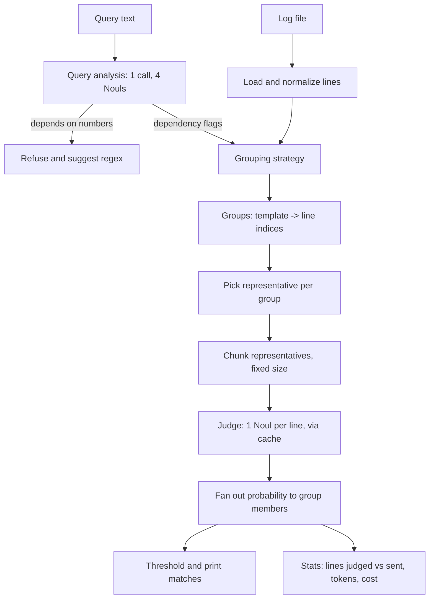

# sift — Query-Aware Deduplication for Semantic Log Search

Semantic log search ("find lines that *mean* X") is useful but costs money per line.
The standard fix, template deduplication, masks the variable parts of a log line
(numbers, IDs, IPs), judges one representative per template, and copies the answer to
every line in the group. That fix is only correct when the question doesn't depend on
the masked parts — and existing tools apply one fixed mask to every query, regardless.

**sift makes the mask depend on the query.** One cheap model call first decides what a
query depends on (usernames? IPs? paths? numbers?), and only the irrelevant parts get
masked. When a query depends on numeric comparison, sift refuses and recommends a regex
instead, because numeric reasoning is a documented weakness of the underlying model.

## The problem, concretely

Log template miners like Drain replace every varying token with a wildcard:

```
Invalid user admin from 173.234.31.186
Invalid user jsmith from 52.80.34.196
→ template: Invalid user <*> from <*>
```

For the query *"failed login attempts"*, merging these two lines is fine — both match.
For the query *"login attempts using default account names like admin, oracle, test"*,
merging is wrong: `admin` matches, `jsmith` doesn't, but a plain dedup tool gives them
the same verdict. Recall or precision quietly breaks, and nothing in the output says so.

**The correctness condition sift is built around:**
> A judgment on a representative can be copied to every member of its group **if and
> only if the query's answer does not depend on anything that differs between members.**

## Results (real data, real API — E1 on Loghub OpenSSH-2k)

`none` = no dedup (per-line ground truth), `drain` = standard template dedup,
`query-aware` = sift. Full run: `results/summary.csv`.

| query | strategy | precision | recall | f1 | lines sent | tokens |
|---|---|---|---|---|---|---|
| Q1 — auth failures / break-ins | none | 0.792 | 0.967 | 0.871 | 100% | 212,596 |
| | drain | 0.999 | 0.994 | 0.996 | **6.6%** | 11,846 |
| | query-aware | 0.999 | 0.994 | 0.996 | **6.6%** | 11,846 |
| Q4 — **default account names** | none | 0.297 | 1.000 | 0.458 | 100% | 234,596 |
| | **drain** | **0.155** | 0.984 | **0.268** | 6.6% | 13,287 |
| | **query-aware** | **0.297** | 1.000 | **0.458** | 100% | 234,596 |
| Q5 — **root login attempts** | none | 0.690 | 1.000 | 0.816 | 100% | 212,596 |
| | **drain** | 0.944 | **0.502** | **0.656** | 6.6% | 11,846 |
| | **query-aware** | 0.690 | **1.000** | **0.816** | 100% | 212,596 |
| Q6 — ports above 50000 | none / drain | attempts it anyway (no safe answer) | | | 100% / 6.6% | |
| | **query-aware** | **refuses** — 0 line-level calls | | | | |

**The headline finding:** on Q4 and Q5, `drain` merges lines with different usernames
and copies one verdict to all of them — its precision on Q4 collapses from 0.297 (the
true per-line rate) to 0.155, and its recall on Q5 collapses from 1.000 to 0.502.
`query-aware` detects that these queries depend on identity, refuses to merge those
groups, and recovers the *exact* `none` numbers — at the cost of judging every line
individually for those two queries specifically (no free lunch when identity truly
matters). On Q1 (identity-independent), `query-aware` matches `drain`'s accuracy at 6.6%
of the token cost of judging every line separately. On Q6, only `query-aware` knows to
refuse the numeric query rather than guess.

## How it works



1. **Load** the log, keeping each line's original index.
2. **Analyze the query**: four yes/no questions (does it depend on identity / network /
   paths / numbers?), asked in one call with an asymmetric threshold biased toward
   "depends" — a false "depends" costs a little money, a false "doesn't depend" costs
   correctness.
3. **Refuse** immediately if the query depends on numeric comparison — no line-level
   calls are made.
4. **Group** lines: `none` (baseline, every line its own group), `drain` (Drain3
   template mining), or `query-aware` (Drain3 groups, then split by whichever extracted
   parameter kinds the query analysis flagged).
5. **Judge** one representative per group (the longest member, so truncation loses the
   least), in fixed-size chunks, one cached model call per chunk.
6. **Fan out** each representative's verdict to every member of its group, threshold,
   and print matches with original line numbers plus a stats line (lines judged vs.
   sent, tokens, resolved model).

## Design decisions

The full rationale for every decision (D1–D13) — why Python, why pin an exact model
name, why cache by content hash, why Noul over Choice, why fixed chunk size across
strategies, why "split, never invent a new masker" — lives in **[DESIGN.md](DESIGN.md)**.

## Limitations

- **Q2 ("a session being opened or closed normally") scores low (~F1 0.09) across every
  strategy equally.** This is not a dedup failure — `none`, `drain`, and `query-aware`
  all score the same, low number. It's a ground-truth labeling artifact: the hand
  labels only count literal PAM session messages, while the model reads "session" more
  broadly to include preauth disconnects. Worth knowing if you're comparing absolute F1
  across queries rather than *relative* behavior between strategies.
- **Numeric queries are refused by design** (D9) — sift will tell you to use `grep -E`
  or `awk` instead, not attempt an unreliable numeric judgment.
- **Multi-line records** (stack traces, git log entries) aren't supported — each log
  line is judged independently.
- **Scale**: E1 (this README's results) ran on the 2,000-line OpenSSH sample. Cost
  savings at realistic scale (20–50k lines) and cross-dataset generalization
  (Apache, Linux) are follow-up work — see `DESIGN.md` §9.2, experiments E2–E5.

## Quickstart

```bash
git clone <this repo> && cd sift
uv sync --extra dev
cp .env.example .env            # paste your TYPESAFE_API_KEY
uv run pytest                   # 68 tests, no API key needed -- everything's faked

# download the evaluation datasets (see data/README.md)
mkdir -p data/raw/OpenSSH && BASE=https://raw.githubusercontent.com/logpai/loghub/master
for suffix in log log_structured.csv log_templates.csv; do
  curl -sL "$BASE/OpenSSH/OpenSSH_2k.$suffix" -o "data/raw/OpenSSH/OpenSSH_2k.$suffix"
done

uv run sift search data/raw/OpenSSH/OpenSSH_2k.log \
  -q "login attempts using default account names like admin, oracle, test" \
  --strategy query-aware
```

Reproduce the results table above:

```bash
uv run python -m eval.run_experiments --dataset OpenSSH
```

## Data & citation

Evaluation data is [Loghub](https://github.com/logpai/loghub) (OpenSSH/Apache/Linux 2k,
corrected), freely available for research/academic use. See `data/README.md` for exact
download commands. If you use these datasets, cite:

> Jieming Zhu, Shilin He, Pinjia He, Jinyang Liu, Michael R. Lyu. *Loghub: A Large
> Collection of System Log Datasets for AI-driven Log Analytics.* ISSRE, 2023.
